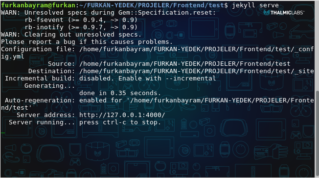
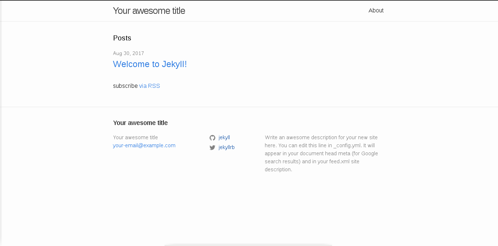

Herkese merhaba. Öncelikle <a href="https://jekyllrb.com/">Jekyll</a> nedir ne işe yarar bize neler sağlar onlardan bahsetmek istiyorum. 
<a href="https://jekyllrb.com/">Jekyll</a>, Github'ın ruby ile geliştirmiş olduğu statik web sayfalar oluşturmamızı sağlayan bir araçtır. <a href="https://jekyllrb.com/">Jekyll</a>'nin resmi web sitesine girdiğimizde bizi "Transform your plain text into static websites and blogs." diye bir yazı karşılıyor. Yani düz metinlerimizi web sitelerine ve bloglara dönüştürebileceğimizden bahsediyor. Tamamen ücretsiz olup hatrı sayılır bir kullanıcı kitlesi vardır. Lafı fazla uzatmadan <a href="https://jekyllrb.com/">Jekyll</a> nasıl kurulur, nasıl çalışır hale getirilir bunlardan bahsetmek istiyorum.

<strong>NOT: Debian 9 kullandığım için anlatımımı Linux işletim sistemleri üzerinden gerçekleştireceğim.</strong>

<h2>Jekyll Kurulum</h2>

<a href="https://jekyllrb.com/">Jekyll</a> ile geliştirme yapabilmek için bilgisayarımızda ruby'nin kurulu olması gerekmektedir.



su 	// ruby kurulumunu gerçekleştirebilmek için sistemde root olmamız gerekiyor


Bizden sistem parolamızı isteyecektir. Girdikten sonra enter'a basıp devam ediyoruz.



apt-get install ruby-full 	// ruby kurulumunu gerçekleştiriyoruz.

exit 				// root modundan çıkıyoruz.


Ruby kurulumunu gerçekleştirdikten sonra <strong>exit</strong> komutuyla root modundan çıkıyoruz.



gem install jekyll 		// jekyll kurulumunu gerçekleştiriyoruz.



NOT: Buraları hızlıca geçmemin sebebi internette çok fazla kaynak ve dökümantasyon olması. Eğer hata alırsanız veya bir sorun ile karşılaşırsanız sosyal medya hesaplarımdan bana ulaşabilirsiniz. Elimden geldiğince yardımcı olmaya çalışırım.

<h2>Jekyll İle İlk Sitemizi Oluşturalım</h2>



jekyll new proje_adı 		// projemizi oluşturuyoruz.
	
cd proje_adı 			// projemizin bulunduğu klasöre giriyoruz.

jekyll serve 			// projemizi çalıştırıyoruz.



<strong>new</strong> komutu ile ilk projemizi oluşturduk. Daha sonra projemizi oluşturduğumuz klasörün içine giriyoruz ve <strong>jekyll serve</strong> komutu ile projemizi çalıştırıyoruz.

Yukarıdaki gibi bir çıktı alırsak sitemiz başarılı bir şekilde oluşmuş ve çalışıyor.
Tarayıcımızı açıp adres çubuğuna, <strong>localhost:4000</strong> yazarsak sitemiz açılacaktır.

Ve sitemiz hazır. İlerleyen yazılarda projedeki klasörlerin ne işe yaradığını, hazır bir temayı nasıl kullanacağımızı, github üzerinden nasıl yayınlayacağımızı ve kendi alan adımızı nasıl kullanacağımızı anlatacağım. 

