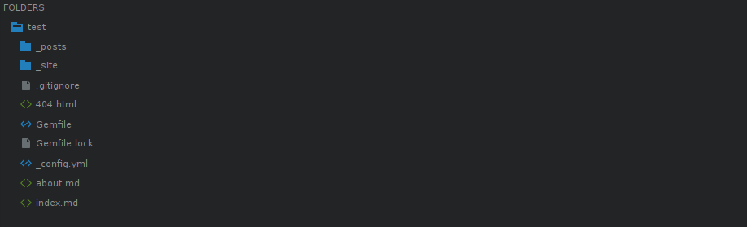
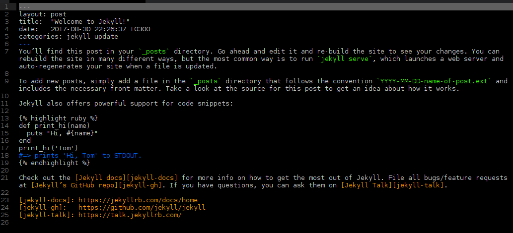
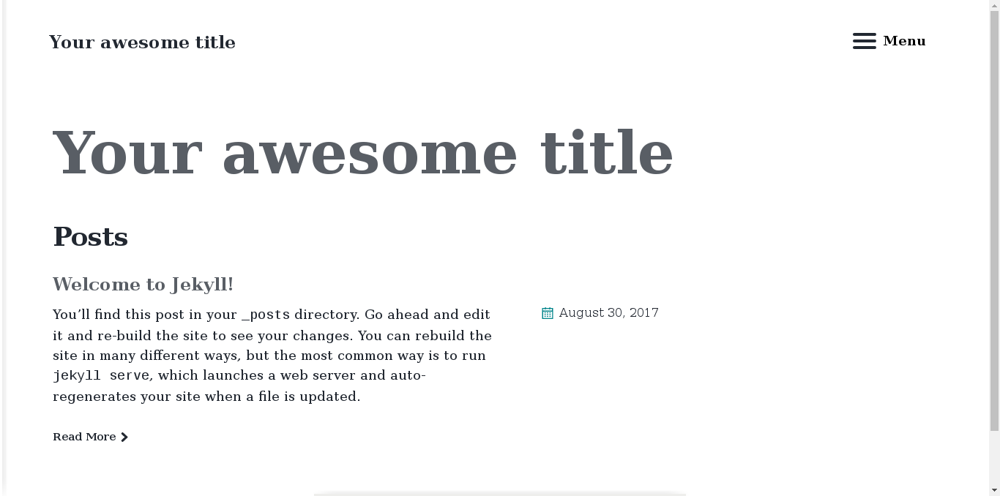

Heerkese merhaba. Önceki yazımda jekyll ile nasıl proje oluştururuz bundan bahsetmiştim. Bu yazımda ise jekyll dosya yapısından, oluşturduğumuz projeyi nasıl özelleştirebileceğimizden ve bazı özelliklerden bahsedeceğim.

<h2>Jekyll Klasör Yapısı</h2>

Oluşturulan bir jekyll projesi genel hatları ile başlangıçta yukarıdaki gibi bir klasör yapısına sahiptir.
Projemizi oluşturduğumuzda hazır olarak <strong>minima</strong> isimli tema ile gelir ve daha sonra istersek sıfırdan bir tema oluşturabiliriz veya hazır olarak bulunan temaları değiştirerek istediğimiz hale getirebiliriz. Klasör yapısından bahsettikten sonra tema konusuna daha detaylı bir şekilde değineceğim. 
Dilerseniz bu klasörler ne işe yarar biraz onlardan bahsedelim.

<h3>_post</h3>
Bu klasörün altında genelde blog sitesi oluşturulduğunda yayınlanacak yazılar bulunur. Bir post yayınlamak için <kbd>yil-ay-gun-post-ismi.md</kbd> şeklinde bir dosya oluşturmamız gerekir.  <strong>Örneğin:</strong> <kbd>2017-08-31-jekyll-dosya-yapisi-ve-bazi-ipuclari.md</kbd> şeklinde kaydedebiliriz. Projemizi oluşturduğumuz zaman aşağıdaki gibi hazır bir post ile gelir. İsterseniz bu örneği inceleyelim.

* layout: Bu dosyanın bir post olduğunu belirtiyoruz.
* title: Postumuzun başlığı. Örneğin bu postun başlığı "Jekyll Klasör Yapısı ve Tema Değiştirme"dır.
* date: Postunuzun yayınlama tarihi ve saati.
* categories: Postunuzun bulunacağı kategori.
* Diğer kalan kısım ise yazımızın içeriğidir. Farkettiyseniz bu dosyayı <strong>.markdown</strong> uzantısı ile kaydetmiştik. Bunun sebebi yazarken <strong>markdown syntax</strong> kullanmamızdır. Eğer markdown syntax hakkında bilginiz yoksa <a href="https://learn.getgrav.org/content/markdown">buradan</a> bilgi edinebilirsiniz.

<h3>_site</h3>
Bu kısım proje çalıştırıldıktan sonra oluşur. Burada sitemizin tüm içeriği bulunur. Statik dosyalar burada tutulur. Örneğin, resimler, css ve js dosyaları.

<h3>404.html</h3>
Kullanıcılar hatalı bir linke yönlendirildiğinde veya adres çubuğuna hatalı bir link girdiklerinde gösterilecek sayfadır. Klasik 404 sayfası oluşturduğumuz gibi html kodları ile bu sayfayı oluşturabiliriz.

<h3>Gemfile</h3>
Burası ruby ile alakalı olan kısımdır. Plugin yüklemek istersek burayı kullanacağız.

<h3>Gemfile.lock</h3>
Bilgisayarımızda yüklü olan pluginlerin listesini verir. Ayrıca projemizde kullandığımız pluginleride buradan görebiliriz.

<h3>_config.yml</h3>
Çok önemli bir kısımdır. Sitemizin alanadı, zaman dilimi, klasör yapısı, plugin ayarları, tema ayarları, sitemizin başlığı, açıklamalar, site sahibi gibi ayarlar buradan yapılır. Buradaki içeriğin çoğunu komut satırından ayarlayabiliriz fakat buradan oluştursak unutma gibi bir problemle karşılaşmaz daha kolay değişiklikler yapabiliriz.

<h3>about.md ve index.md</h3>
Temanın oluşturduğu dosyalardır. Sitemizde açılış sayfasında <v></v>e hakkımda linkine tıklandığında gösterilecek içerik buradan belirlenir. İlerleyen zamanlarda buraya eklemeler yapabiliriz. Örneğin: Projeler, Kategoriler, Arşiv, Blog.

<h2>Hazır Tema Kullanımı</h2>
Jekyll ile önceden diğer kullanıcılar tarafından oluşturulmuş bir çok hazır tema vardır. Bu temaları<a href="www.jekyllthemes.com"> buradan</a> görebilirsiniz. Ben örnek olarak <a href="https://mmistakes.github.io/jekyll-theme-basically-basic/">jekyll-theme-basically-basic</a> temasını kullanacağım.  

Temayı yüklemek için projemizin bulunduğu klasöre giriyoruz.



nano Gemfile //Gemfile dosyasını nano ile terminal ekranında başlatıyoruz.



Gemfile dosyası açıldıktan sonra <strong>gem "minima", "~> 2.0"</strong> yazısının hemen alt satırına <strong>gem "jekyll-theme-basically-basic"</strong> yazıyoruz. Altına yazmamızın sebebi düzenli gözükmesi için. İsterseniz bu dosya içinde farklı bir yerede yazabilirsiniz. <strong>CTRL + X</strong> tuşlarına basıp çıkan uyarıya <strong>Evet</strong> deyip kaydedip çıkıyoruz. 



nano _config.yml //_config.yml dosyasını nano ile terminal ekranında başlatıyoruz.



Sayfanın altlarına inip <strong>themes: minima</strong> yazan kısmı buluyoruz ve <strong>minima</strong> kısmını <strong>jekyll-theme-basically-basic</strong> şeklinde değiştiriyoruz. Yine aynı şekilde <strong>CTRL + X</strong> tuşlarına basıp <strong>Evet</strong> deyip kaydedip çıkıyoruz.



bundle install // temamızı yüklüyoruz.
jekyll serve   // projemizi çalıştırıyoruz.



<h3><strong>Tebrikler.</strong></h3>
Yukarıda gördüğünüz gibi temamız değişti. Bundan sonra içerik üretmek veya temayı özelleştirmek sizin zevkinize kalmış. Eğer isterseniz kendinizde sıfırdan bir tema oluşturabilirsiniz.  

Yazımı sonuna kadar okuduğunuz için teşekkür ederim. Umarım faydalı bir yazı olmuştur. Görüşmek üzere.
