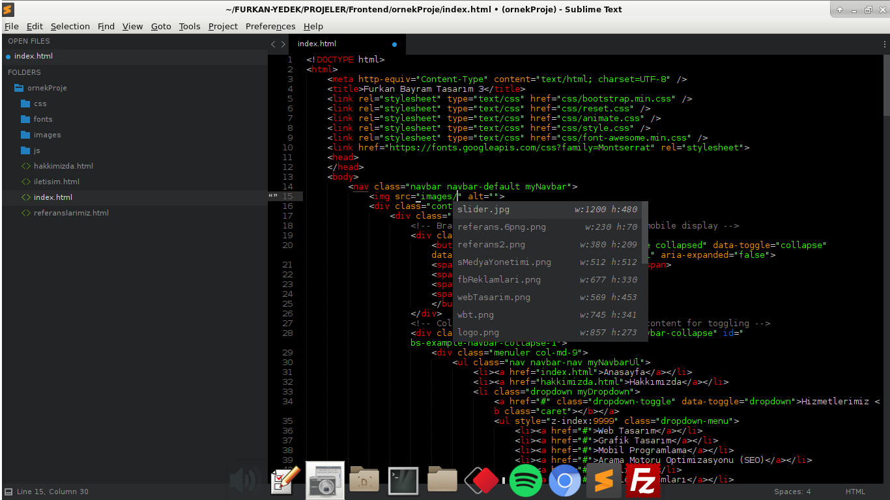
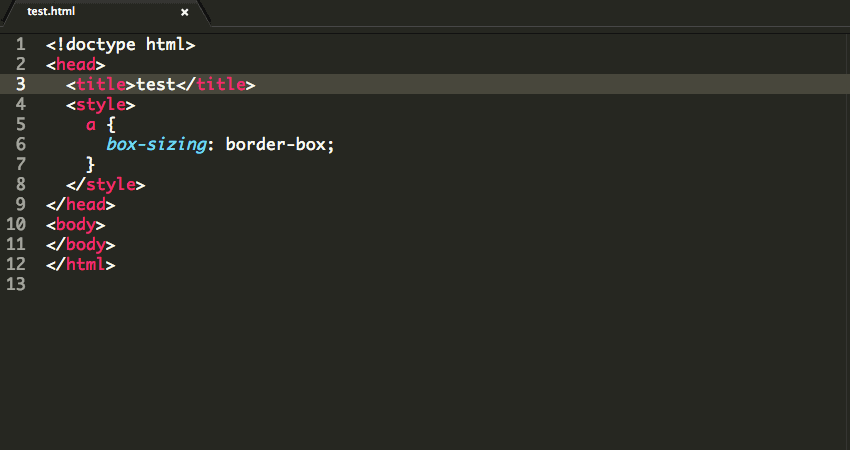
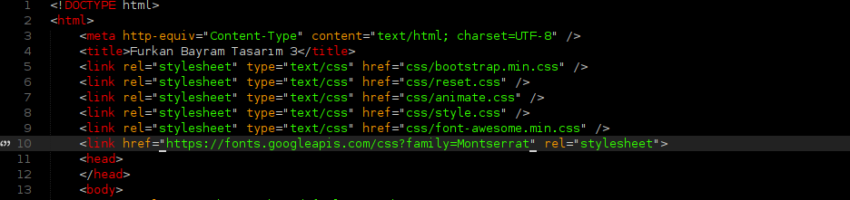
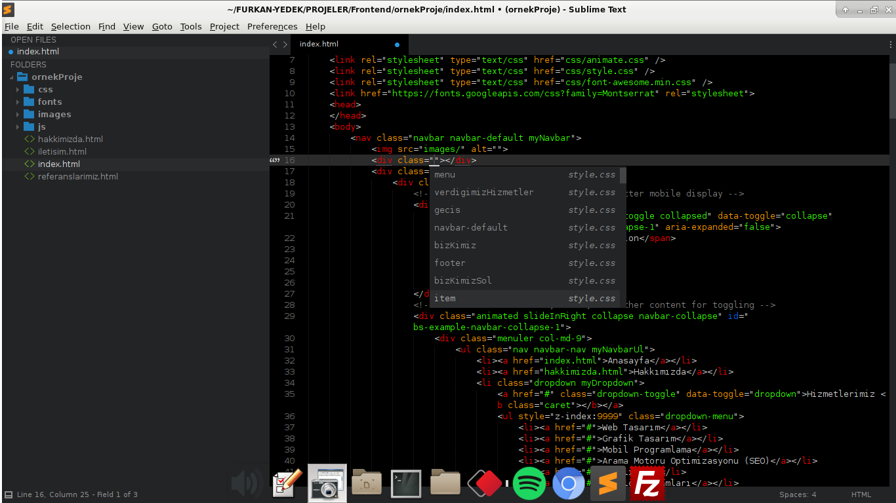

Herkese merhaba. Uzun zamandır geliştirme yaparken <strong>Brackets</strong> metin editörünü kullanıyordum. Son 1 haftadır bu editörün performansından rahatsızlık duymaya başladım. Bu yüzden yeni bir metin editörü arayışına girdim. En az 3-4 adet editör değiştirdim ve sonunda <strong>Sublime Text 3</strong> kullanmaya karar verdim. Bu yazımda <strong>Linux</strong> işletim sistemine <strong>Sublime Text 3</strong> nasıl kurulur, eklentiler nasıl yüklenir, editör nasıl özelleştiriler vb. konulardan bahsedeceğim.

<h1>Sublime Text 3 Kurulumu</h1>

Terminalimizi açıp aşağıdaki komutları çalıştırıyoruz.



wget http://c758482.r82.cf2.rackcdn.com/sublime-text_build-3083_amd64.deb 

sudo dpkg -i sublime-text_build-3083_amd64.deb



Yukarıdaki komutlar ile <strong>Sublime Text 3</strong>'ü bilgisayarımıza indiriyoruz. Daha sonra ise kurulum işlemini gerçekleştiriyoruz.  

YÜkleme işlemi tamamlandıktan sonra komut satırına <strong>subl</strong> yazıp editörümüzü çalıştırıyoruz.

<h1>Sublime Settings</h1>

<strong>Sublime Text</strong> tamamen açık kaynak kodlu bir editördür. Yani istediğiniz değişikliği istediğiniz şekilde yapabilirsiniz. Tüm ayarlar <strong>Preferences.sublime-settings</strong> altında bulunur. Burayı açmak için yukarıdaki menüden <strong>Preferences / Settings</strong> diyoruz. Örnek olarak aşağıda kendi <strong>Preferences.sublime-settings</strong> dosyamı paylaşıyorum.


 {
	"bold_folder_labels": true,
	"color_scheme": "Packages/Base16 Color Schemes/Themes/base16-isotope.tmTheme",
	"font_face": "Menlo",
	"font_size": 10,
	"highlight_line": true,
	"ignored_packages":
	[
		"Vintage"
	],
	"line_padding_bottom": 1,
	"line_padding_top": 1,
	"theme": "Boxy Tomorrow.sublime-theme",
	"theme_sidebar_disclosure": true,
	"theme_sidebar_font_md": true,
	"theme_sidebar_size_xxs": true,
	"theme_unified": true
}



<h1>Paket Yöneticisinin Kurulumu</h1>

Eklenti kurulumuna geçmeden önce <strong>paket yöneticisinin</strong> kurulumunu gerçekleştirmemiz gerekiyor.
Bunun için <a href="https://packagecontrol.io/installation">buraya</a> tıkladıktan sonra açılan sayfadaki <strong>Sublime Text 3</strong> sekmesi altındaki kodları kopyalıyoruz.  
Daha sonra editörümüzü açıp menülerden <strong>View / Show Console</strong> diyoruz. Kopyaladığımız kodları açılan konsol ekranına kopyalıyoruz ve <strong><kbd>ENTER</kbd></strong> tuşuna basıp <strong>paket yöneticisinin</strong> kurulumunu tamamlıyoruz.

<h1>Eklentilerin Kurulumu</h1>
Eklentilerin kurulumu için editörümüzdeki menüden <strong>Tools / Command Palette</strong> dedikten sonra açılan bölüme <strong>install package</strong> yazıp, <strong>Package Control: Install Package</strong> bölümüne giriyoruz.  
İşte bu açılan kısım eklentilerin listelendiği bölüm. Buradan işimize yarayan, istediğimiz eklentiyi artık yükleyebiliriz.  
Aşağıda, kod yazarken kullandığım, işinizi kolaylaştıracak bazı eklentileri paylaşacağım.

<h2>1. AutoFileName</h2>

Bu eklenti dosya adlarını otomatik olarak tamamlıyor ve dosya isimlerini yazarken yazım hatası yapmamızı en aza indiriyor. Örneğin <strong>href</strong> etiketlerinde, html içindeki <strong>img</strong> etiketlerinde yol belirtirken veya stil dosyalarında <strong>background-image</strong> için yol belirtirken aynı seviyedeki veya alt seviyelerdeki dosya ve klasörleri görmemizi sağlıyor. Ayrıyetten resimlere ait <strong>yükseklik X genişlik</strong> değerlerinide görebiliyoruz.
  

<h2>2. Autoprefixer</h2>

CSS yazarken işlerimizi kolaylaştıracak bir eklenti bu. Örneğin, <strong>transform</strong> özelliğinin chrome veya safari gibi tarayıcılarda çalışması için <strong>-webkit-transform</strong>, IE için ise <strong>-ms-transform</strong> yazmamız gerekiyor. Bu eklenti sayesinde bunları ayrı ayrı yazmıyoruz. 

<h2>3. BracketHighlighter</h2>

Artık parantezi açtım mı, tırnağı kapattım mı derken şaşı olmaya son :) Bu eklenti sayesinde parantezlerin veya tırnak içindeki alanların başlangıç veya bitişlerini çok rahat bulabileceksiniz. Adındanda anlaşılacağı gibi başlangıç ve bitiş kısımlarını belirgin hale getiriyor.

<h2>4. Boxy Theme</h2>

Boxy Theme içinde onlarca tema bulunduruyor. Eğer bu temalar hoşunuza gitmese bile editörünüzü istediğiniz şekilde değiştirebilirsiniz. Menülerin renklerini, yazı fontlarını, yazı renklerini, menü stillerini vb. bir çok özelliği çok basit bir şekilde bu eklenti ile değiştirebilirsiniz.
  

<h2>5. CSS Extended Completions</h2>

Bir tek <strong>CSS Extended Completions</strong> olsun bana bir şey olmaz :) diyebileceğim bir eklenti. Stil dosyalarınızdaki fonksiyon, class ve id isimlerini html içerisinde kullanırken, daha siz yazmadan otomatik olarak tamamlıyor. Yeni bir CSS freamworküne başlayacağınız zaman bu eklenti bulunmaz bir veli nimet. Yabancısı olduğunuz freamworke, bu eklenti sayesinde kolayca alışabilirsiniz.

  
<h2>6. Emmet</h2>

<strong>Emmet</strong> eklentisini isterseniz uygulamalı olarak açıklayayım.  
<strong>div.ul>li*5</strong> yazıp editörümüzde <strong><kbd>TAB</kbd></strong> tuşuna basarsak çıktı şu şekilde olacaktır.


 

 	<ul class="li"></ul>
 	<ul class="li"></ul>
 	<ul class="li"></ul>
 	<ul class="li"></ul>
 	<ul class="li"></ul>
 



<strong>Emmet</strong> için ileriki zamanlarda ayrı bir yazı yazacağım. Çünkü tam anlamıyla kullanımı öğrenildiğinde, zamandan baya bir tasarruf etmemizi sağlıyor. İncelemek isterseniz <a href="https://docs.emmet.io/">buradan</a> dökümantasyonuna, <a href="https://docs.emmet.io/cheat-sheet/">şuradan</a> da kısayollara ulaşabilirsiniz.

<h2>5. HTML/CSS/JS Prettify</h2>
Tek kombinasyon ile html, css ve javascript dosyalarımızı okunabilir, girinti yapısına uygun bir şekilde düzenliyor. Default tuş kombinasyonu <strong><kbd>CTRL + SHİFT + H</kbd></strong>  
<strong>NOT: Çalışması için sisteminizde nodejs kurulu olmalıdır.</strong>

Evet arkadaşlar yazımızın sonuna geldik. Diğer yazılarda görüşmek üzere, hoşçakalın.

